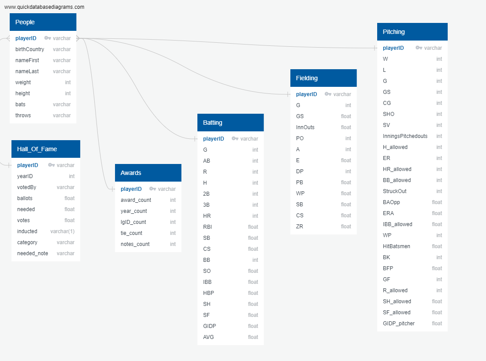

# Project_Finale

# SEGMENT #1

# Team Roles
For Segment 2, Nick worked on the Database section again this week.  Dane worked on the Machine Learning Model and provided the [provisional code](logistic_regression_MLmodel.txt) that connects to this provisional database.

# Database
The database for this project is built in PostgreSQL using pgAdmin4.

## Data

### Raw Data
Raw data was obtained in the form of several CSV files from [Lahman's Baseball Database](http://www.seanlahman.com/baseball-archive/statistics/).  Attempts to load this data as it was downloaded presented some unique problems that will need to be addressed as we move forward in the project.

### Pre-Processing
As noted above, the raw data was not in a format that could be loaded into our database and needed to be pre-processed in order to be useful for the machine learning model.  Each csv file needed to have a column with unique rows to use for a primary key.  We chose the playerID as this unique identifier.  To achieve this, the Hall of Fame file was modified by dropping all of the duplicate entries of playerID and only keeping the last entry since this would tell us if the player was inducted or not.  The Batting, Fielding, and Pitching statistics were grouped by playerID and aggregated to provide career statistics for each player.  Finally, the Awards data was simply grouped by playerID to obtain a count of awards that each player received over their career.  Each csv is read in, cleaned, and then exported to provide the format that can be loaded into our PostgreSQL database.  The code to perform this pre-processing is found in the file:  [preprocessing_data.ipynb](preprocessing_data.ipynb).

## Structure
The database was designed using the QuickDBD tool.  The revised ERD is shown below in Fig.1.   
Now that the data has been cleaned the primary keys are much simplier than our first attempt.  When trying to load the cleaned csv's into the database we found that our foreign key assignments were not allowing us to load in the data.  This was due to the fact that not all of the same playerID's were in each csv.  To overcome this, we pulled the csv with a master list of players and tied all of the other tables to this one with foreign keys.  

**Fig.1:**

### Accessing the Database
Since our PostgreSQL database is hosted locally, it will be necessary for each team member to create a database on their machine.  The following are steps to do so:

1. Pull the cleaned csv from the [data directory](/data)
    * HOF.csv
    * Batting_cleaned.csv
    * Fielding_cleaned.csv
    * Pitching_cleaned.csv
    * award_count.csv
    * People_cleaned.csv
2. Create a database instance in pgAdmin4
3. Use the queries in the file [schema_Rev2.sql](schema_Rev2.sql) to create the necessary tables
4. Manually import the csv's above into the database tables
5. Run the queries in the file [queries.sql](queries.sql) to join the tables
6. Manually export these new tables to csv's if desired

Note:  We can test our machine learning model by pulling in these csv's prior to the final production ready code that will pull directly from the database.  

# SEGMENT #2

## Team Roles
Nick again focused on the database for Segment #2.   

## Pre-Processing Raw Data
Following Segment #1 where a preliminary database was created, it was necessary to address several problems that were encountered.  The foremost issue being that the database tables did not have a true primary key.  That is, there was no unique identifier for each row of data.  Despite attempts to employ a composite primary key, the raw csv files could not be used in their current form.  Following group discussion, it was decided that the batting, fielding, and pitching statistics would be aggregated to produce career statistics.  This was accomplished by using the Pandas groupby method, and provided a single row of data unique to each playerID.  To get this same result for the Hall of Fame table, we needed to drop duplicates and keep the last row (this would keep a yes if the player was inducted and keep a no if they were not).  Finally, the group decided to use a total count of awards from the awards csv data.  Once these changes were made, the Pandas dataframes were exported to csv files so they could be imported into the PostgreSQL database. 
 
The code to accomplish these tasks can be found in the Juptyer Notebook:  [preprocessing_data.ipynb](preprocessing_data.ipynb)

### Updated Database
The database design was updated using QuickDBD.  The .sql was exported from QuickDBD's website and used to create the tables in pgAdmin4.  Due to the structure of the raw data files, the queries were modified to remove the not null constraints that were defaulted in QuickDBD.   
[schema_Rev2.sql](schema_Rev2.sql)

### Challenges
When attempting to import the pre-processed csv files to the PostgreSQL database, we ran into an issue with foreign keys.  Since not all of the playerID's were in each table, we were getting an error when trying to load data.  To overcome this error, we pulled in the master list of players (people.csv) and tied all of the other tables to it with playerID as foreign keys.  See Fig.1 for the revised ERD.

**Fig.1:**

## Connection to Machine Learning Algorithm

### Interim Step
As a first step, and in order to test the machine learning algorithm, we first query the database to create new tables which could then be exported as csv files.  These csv files could then be easily loaded to Pandas dataframes by other group members while I worked on connecting the database directly to the machine learning code.  This also allowed the other team members to work through the machine learning code without having to set up the database on their local machines (since our PostgreSQL database is hosted locally). 
The queries made in pgAdmin4 can be found in the file:  [queries.sql](queries.sql) 
Additionally, the csv's exported out of the database for testing the ML code can be found in the [data directory](/data):  
* ml_table.csv (all data combined)
* ml_pitching.csv
* ml_BattingFielding.csv

### Final Connection
Finally, the code was developed to directly connect the PostgreSQL database to the machine learning code.   A bit of pre-processing was necessary to remove NaN's as the ML code did not like empty values in the dataframe it was being fed.  Also, the inducted column needed to be encoded from text to numeric datatype.   
This code can be found in the Jupyter Notebook:  [HOF_randomF.ipynb](HOF_randomF.ipynb)

