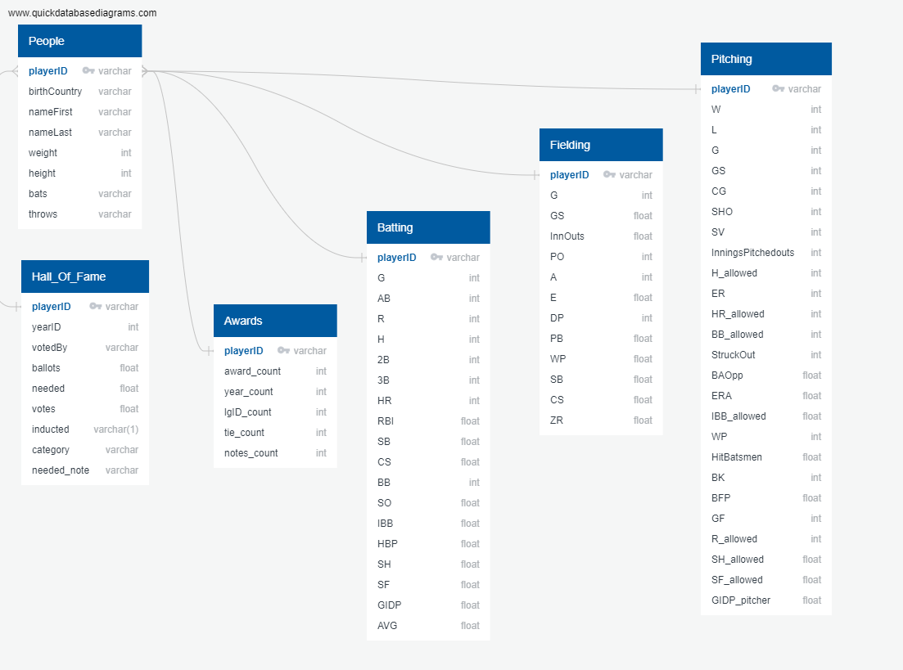

# Final Project

## Team Roles
Nick again focused on the database for Segment #2.   

## Pre-Processing Raw Data
Following Segment #1 where a preliminary database was created, it was necessary to address several problems that were encountered.  The foremost issue being that the database tables did not have a true primary key.  That is, there was no unique identifier for each row of data.  Despite attempts to employ a composite primary key, the raw csv files could not be used in their current form.  Following group discussion, it was decided that the batting, fielding, and pitching statistics would be aggregated to produce career statistics.  This was accomplished by using the Pandas groupby method, and provided a single row of data unique to each playerID.  To get this same result for the Hall of Fame table, we needed to drop duplicates and keep the last row (this would keep a yes if the player was inducted and keep a no if they were not).  Finally, the group decided to use a total count of awards from the awards csv data.  Once these changes were made, the Pandas dataframes were exported to csv files so they could be imported into the PostgreSQL database. 
 
The code to accomplish these tasks can be found in the Juptyer Notebook:  [preprocessing_data.ipynb](preprocessing_data.ipynb)

### Updated Database
The database design was updated using QuickDBD.  The .sql was exported from QuickDBD's website and used to create the tables in pgAdmin4.  Due to the structure of the raw data files, the queries were modified to remove the not null constraints that were defaulted in QuickDBD.   
[schema_Rev2.sql](schema_Rev2.sql)

### Challenges
When attempting to import the pre-processed csv files to the PostgreSQL database, we ran into an issue with foreign keys.  Since not all of the playerID's were in each table, we were getting an error when trying to load data.  To overcome this error, we pulled in the master list of players (people.csv) and tied all of the other tables to it with playerID as foreign keys.  See Fig.1 for the revised ERD.

**Fig.1:**

## Connection to Machine Learning Algorithm

### Interim Step
As a first step, and in order to test the machine learning algorithm, we first query the database to create new tables which could then be exported as csv files.  These csv files could then be easily loaded to Pandas dataframes by other group members while I worked on connecting the database directly to the machine learning code.  This also allowed the other team members to work through the machine learning code without having to set up the database on their local machines (since our PostgreSQL database is hosted locally). 
The queries made in pgAdmin4 can be found in the file:  [queries.sql](queries.sql) 
Additionally, the csv's exported out of the database for testing the ML code can be found in the [data directory](/data):  
* ml_table.csv (all data combined)
* ml_pitching.csv
* ml_BattingFielding.csv

### Final Connection
Finally, the code was developed to directly connect the PostgreSQL database to the machine learning code.   A bit of pre-processing was necessary to remove NaN's as the ML code did not like empty values in the dataframe it was being fed.  Also, the inducted column needed to be encoded from text to numeric datatype.   
This code can be found in the Jupyter Notebook:  [HOF_randomF.ipynb](HOF_randomF.ipynb)
