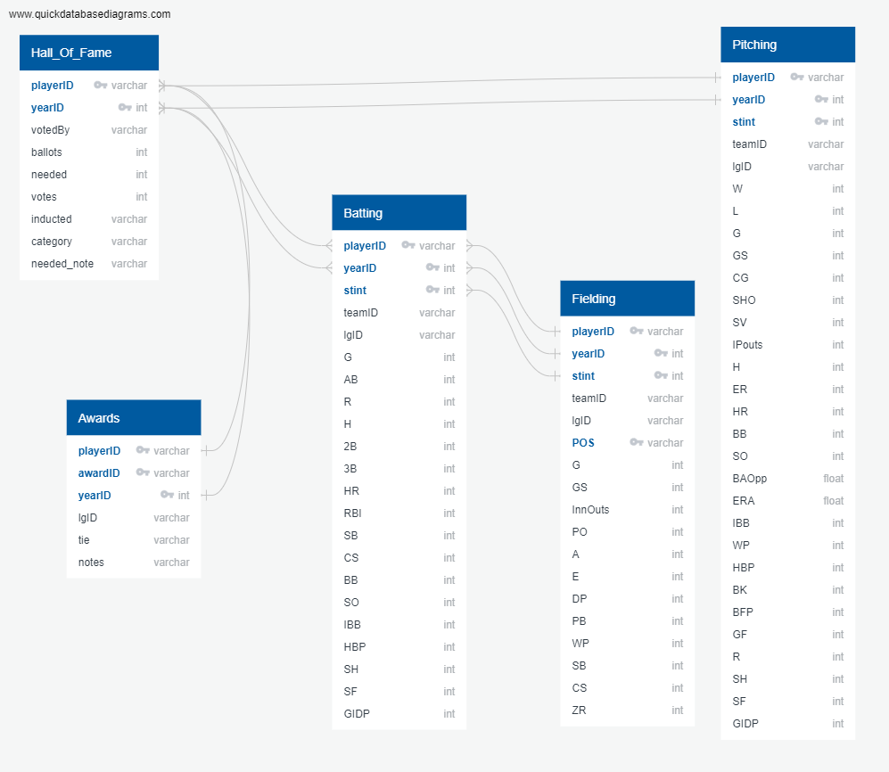

# Final Project

# Description of Communication Protocols:

### Slack Direct Messaging
- Project team members will use an open platform for communication using a unique Slack direct messaging group.

### Pull Requests
- Pull requests will initiate discussion about team member commits. Pull requests help start a code review and conversation about proposed changes before they're merged into the master branch.

## Baseball Hall of Fame Inductees

Established in 1936, the Baseball Hall of Fame (HOF) recognizes the best baseball players in the game. Inductees are selected each year, and join a Hall of Fame Class. The players selected join a caste of the best players and most noted names in the game and include more than 300 players.

## Overview

The goal is to develop a model that is capabable of selecting the probable elected players based on player performance and awards.

Each player that is selected for a HOF class is elected by commitee. Any candidate that meets the threshold of 75% of the comitee vote will be considered elected to the HOF. Using Logistic regresion, the aim is to be able to predict future players based on past class electees perofmance.

## Data
Data for this project was attained from seanlahman.com

The data is contained in a number of .csv file all of which are available fro the source website.

the specific .csv files used are:

    1) HallofFDame.csv
    2) Batting.csv
    3) Pitching.csv
    4) Fielding.csv
    5) Awards.csv

## Expected outcomes

Machine learning model that predicts HOF players based on performance in batting, fielding pitching and awards.
Questions to answer

    1) Can the model select the appropriate HOF canditate.
    2) Accuracy of the model overall
    3) Does previous awards help identify players that may be inducted
    4) Does player popularity effect the election results.
    5) Does statistical performance predict candidates

# Database
The database for this project is built in PostgreSQL using pgAdmin4.

## Raw Data
Raw data was obtained in the form of several CSV files from [Lahman's Baseball Database](http://www.seanlahman.com/baseball-archive/statistics/).  Attempts to load this data as it was downloaded presented some unique problems that will need to be addressed as we move forward in the project.  

## Structure
The database was designed using the QuickDBD tool.  The ERD is shown below in Fig.1.   
Due to the manner in which the data is provided in the various csv files, composite primary keys must be used in order to ensure unique row identifiers.  As we move through the project and determine how we need the data to look, this ERD will be updated.

**Fig.1:**

## Challenges
As it currently stands, there are several issues with the structure of the database that will need to be addressed to move forward with the project.  Most notably, we need to get the data in the tables to a state where they can be joined easily and correctly for the machine learning model. Much of this can likely be pre-processed by reading the csv's into pandas df's and returning a clean csv, which can be then loaded into the postgreSQL database.  This should be the main focus for the Circle Role in week 2.  

* How to join Hall of Fame table with statistics tables since each have rows with multiple years and potentially several entries per year for each playerID?  Will the yearID in the Hall of Fame table really be necessary as we will be attempting to tie the stats to past years to a players induction? 
* How to combine rows for players that are traded during the season (i.e. multiple rows with the same playerID and yearID)?
* Should the stats be computed as an average per year for each player rather than looking at each year individually since the players are not up for Hall of Fame votes in the same year as they played?  
